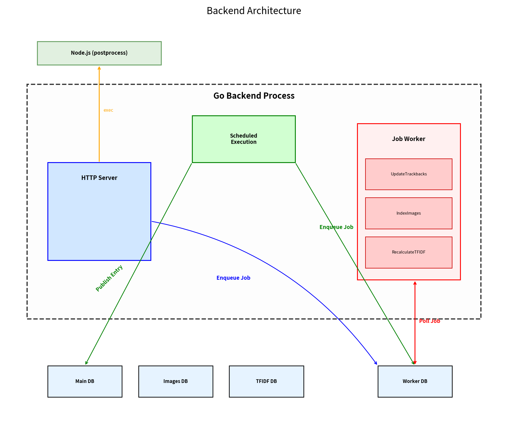
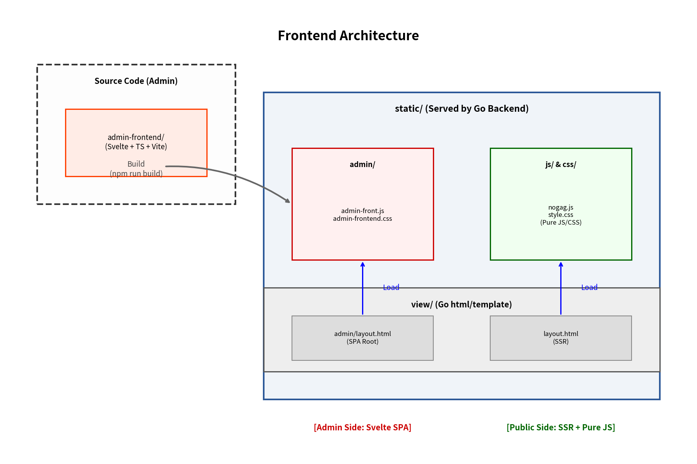
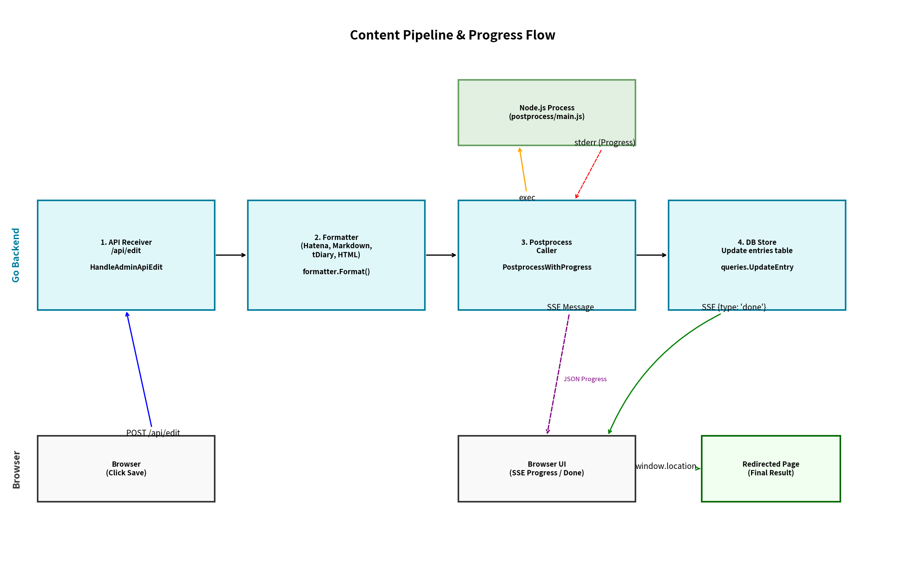

# Hanrangon (Go Implementation)

[](https://github.com/cho45/hanrangon/actions/workflows/ci.yml)

Perl 版 Nogag (氾濫原) の Go (Golang) によるリライトプロジェクト。
"Hanra-n-Go-n" (氾濫原 + Go).

## 設計思想

システムの長期的な運用性と保守性を確保するため、以下の設計方針を採用している。

### データベースの分離とバックアップ効率
データベースを `Data`, `Images`, `TF-IDF`, `Worker` の 4 つに物理的に分割している。バックアップが不可欠な記事データを、再生成可能あるいは肥大化しやすいインデックスやログから分離することで、バックアップサイズの最小化とメンテナンスの効率化を実現している。また、`WAL` モードにおける書き込み競合の影響範囲を限定する。

### ポストプロセスによる表示品質の確保
`MathJax` や `Highlight.js` といった成熟した JavaScript ライブラリを活用するため、`Node.js` をサイドカーとして利用している。`jsdom` を用いてブラウザ環境に近い状態でサーバー側レンダリング（事前整形）を行い、静的な HTML として保存することで、閲覧時の高速なコンテンツ表示を可能にしている。

### 安定した言語解析と関連記事表示
関連記事抽出のための `TF-IDF` 計算には、文字 2-gram (Bigram) 方式を採用している。形態素解析器と比較してメモリ消費が少なく、辞書のメンテナンスも不要である。日本語における分かち書きの精度に左右されず、安定したターム抽出と検索性を確保している。

### 外部依存の排除によるメンテナンスコストの削減
`Redis` 等の外部ミドルウェアを必要とせず、`SQLite` ベースのジョブキューを内蔵している。Node.js によるサイドカープロセス等の依存はあるものの、システム全体がプロジェクト内のリソースで完結するように構成されている。外部ミドルウェアへの依存を最小限に抑えることで、依存先のバージョンアップや設定の不整合に伴うトラブルを回避し、長期的な運用におけるメンテナンスコストの削減を優先している。

### 多様なテキストフォーマットへの対応
はてな記法、tDiary 記法、`Markdown`、`HTML` に対応している。

## Architecture

システムの構造と処理フロー。

### Backend Architecture
システムのコンポーネント構成と非同期ジョブのフロー。


### Frontend Architecture
公開側（SSR）と管理画面（Svelte SPA）の構成。


### Content Pipeline
記事の投稿からフォーマット、ポストプロセス、保存、そして進捗通知（SSE）の流れ。


## Prerequisites

- Go 1.24+ (CGo required for SQLite and AVIF)
- `Node.js` (記事保存時のポストプロセスおよび管理画面のビルドに使用)
- `sqlc` CLI (DB コード生成に使用)
- `goimports` (コードのフォーマットに使用)
- `air` (開発時のホットリロードに使用)

> [!NOTE]
> AVIF のデコードには `vegidio/avif-go` を使用しています。主要な OS/アーキテクチャ（Linux, macOS, Windows）向けの静的ライブラリが同梱されているため、通常はシステム側に `libavif` をインストールする必要はありません。

## Setup & Run

### 1. 依存ツールのインストール

```bash
make setup
```

### 2. 各種セットアップ (ビルド・依存関係)

```bash
# Admin Frontend のビルド (Vite/Svelte 5)
make build-fe

# Node.js 依存関係 (ポストプロセス) のインストール
cd postprocess && npm install
```

### 3. 設定

`config.toml.sample` を `config.toml` にコピーして編集。

```bash
cp config.toml.sample config.toml
```

### 4. サーバーの起動

```bash
# 開発用 (ホットリロード & フロントエンド HMR 有効) - 推奨
make watch

# または、通常の起動 (go run)
make run
```

デフォルトで http://localhost:5555 で動作。

## Database & Code Generation

SQL スキーマ (`db/schema/`) やクエリ (`db/query/`) を変更した場合は、`sqlc` を使用して Go のモデルコードを再生成する必要があります。

```bash
make generate
```

## Subcommands

以下のサブコマンドをサポート。

- `serve`: サーバーの起動（デフォルト）
- `reformat`: 全記事の再フォーマット
- `recalc-tfidf`: `TF-IDF` の再計算
- `backup`: データベースのバックアップ
- `index-images`: 記事に含まれる画像のインデックス作成。以下のオプションを組み合わせて使用可能。
    - `--sync`: 記事本文から画像 URL を抽出し、データベースのレコードと同期（追加・削除）する。
    - `--fill`: 署名（指紋）が未作成の画像に対して、カラーヒストグラムベースのシグネチャを生成し、インデックス化する。
    - `--overwrite`: 既にインデックス済みの画像も含め、すべての画像の署名を再計算する。アルゴリズム変更時などに使用。
    - `--force`: 実際の処理を実行する（指定しない場合は説明のみ表示）。
    - 仕組み: 画像の「色の指紋（64bit カラービットマスク）」を生成し、`Jaccard 係数` で類似度を判定。`12bit スライディングウィンドウ` により SQL レベルでの高速な候補絞り込みを実現。
- `update-password`: 管理者パスワードの更新
- `recalc-metadata`: メタデータの再計算

実行例:
```bash
make
./hanrangon update-password
```

## 管理画面 (Admin Panel)

`Svelte` による `SPA` 管理画面。

- 技術スタック: `Svelte 5`, `Vite`, `TypeScript`
- 主な機能:
    - エントリ管理: 記事の作成・編集・削除。オートセーブ、画像アップロード、公開予約に対応。
    - 画像管理: 記事内画像の検索・一覧表示、およびカラーシグネチャによる類似画像の自動抽出・表示。
    - ジョブ監視: 内蔵ジョブキューの実行状況、エラーログの確認。
    - システム情報 (Info): TF-IDF 統計、画像インデックス状況、メモリ使用量、構成設定の確認。
- 開発とビルド:
    - `admin-frontend/` ディレクトリで `npm run dev` を実行することで HMR 有効な開発が可能。
    - `make watch` を使用すると、フロントエンドの開発サーバーと Go のホットリロード (`air`) を同時に起動可能。
    - `npm run build` により、ビルド成果物が `static/admin/` に出力され、Go サーバー経由で配信。

## Project Structure

### Backend (Go & Content Pipeline)
- **Core Logic**
  - `app/`: アプリケーションのコアロジック（ハンドラー、サーバー構成、設定）。
  - `model/`: データベースモデル。`sqlc` 生成コードと手動定義のロジックを含む。
  - `db/`: SQL スキーマ (`schema/`) とクエリ定義 (`query/`)。
  - `internal/`: プロジェクト内部でのみ使用される共通ユーティリティ（テストヘルパー等）。
  - `var/`: SQLite データベースファイル、およびキャッシュデータの格納場所。
  - `main.go`: エントリーポイントおよびサブコマンドのディスパッチ。
- **Content Pipeline**
  - `formatter/`: 各種記法（Hatena, tDiary, Markdown）のパーサ。
  - `xatena-go/`: はてな記法パーサの Go 実装（ローカル依存ライブラリ）。
  - `postprocess/`: `Node.js` による HTML ポストプロセス（MathJax, 構文ハイライト）。
  - `tfidf/`: 文字 2-gram による `TF-IDF` 計算と関連記事抽出ロジック。
- **Background & CLI**
  - `jobqueue/` & `jobs/`: ジョブキュー基盤と非同期ジョブの実装。
  - `subcommands/` & `cmd/`: CLI サブコマンドと運用ツールの実装。
- **Deployment & Development**
  - `deploy/`: デプロイスクリプト、およびシステム設定ファイル（systemd 等）。
  - `scripts/`: アイコン生成やメンテナンス用の開発スクリプト。
  - `sketch/`: 検証用および実験的なコード・スクリプト。
  - `docs/`: 設計ドキュメント、移行手順書、およびアーキテクチャ図。

### Frontend (Public)
- `view/`: 公開側の HTML/XML テンプレート。`app/template.go` を介して描画されます。
- `static/`: 公開用の静的アセット (CSS, JS, Images)。

### Frontend (Admin)
- `admin-frontend/`: `Svelte 5` による管理画面 SPA のソースコード。
- `static/admin/`: ビルド済みの管理画面アセット。

## Testing

インメモリ `SQLite` を使用した統合テストが可能。`SQLite` の数学関数を使用するため、`sqlite_math_functions` タグが必要。

```bash
make test
```

`Node.js` によるポストプロセスのテスト:

```bash
make postprocess-test
```
