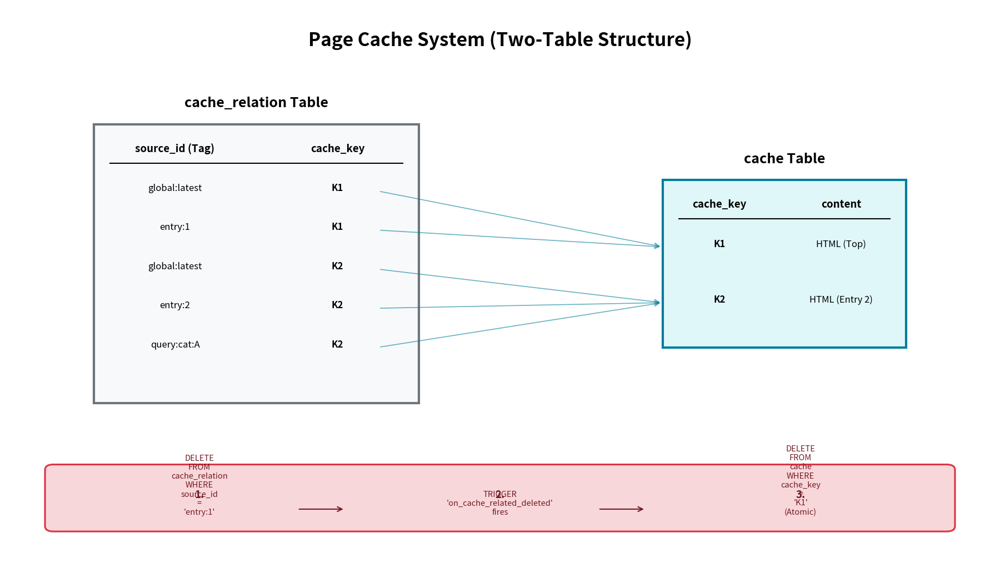

# ページキャッシュと無効化設計

公開ユーザー向けページのレスポンス高速化のため、SQLite をバックエンドとしたページキャッシュシステムを導入している。

## 構成

- **保存先**: `Cache DB (cache.db)`。再生成可能なデータとして独立。
- **実装**: `backend/app/page_cache.go`。`PageCacheMiddleware` により透過的に処理。
- **対象**: 非認証ユーザーによる GET/HEAD リクエスト。

## 仕組み

1.  **キャプチャと保存**: キャッシュミス時、ハンドラが出力するレスポンスをキャプチャする。
2.  **圧縮と保存**: キャプチャしたレスポンスを元に、Gzip 圧縮版 (`:gzip`) と ETag のみの非圧縮版 (`:raw`) を同期的に保存する。
3.  **ゼロ圧縮配信**: キャッシュヒット時、クライアントが Gzip 対応であれば事前に作成された `:gzip` バイナリを直接配信する。これにより、リクエストごとの圧縮コスト（CPU負荷）を排除している。
4.  **互換性**: Gzip 非対応のクライアントには、`:gzip` キャッシュをオンデマンドで解凍して返却する。
5.  **可視化**: レスポンスヘッダー `X-Cache: HIT`, `MISS` を付与する。

## 依存関係管理 (source_id)

エントリの更新時に、影響を受ける全てのページキャッシュを確実に削除するため、キャッシュエントリと表示ソースの間の多対多の依存関係を `cache_relation` テーブルで管理する。

### source_id の命名規則

ハンドラ内で `c.Set("cache_source_ids", []string{...})` を通じて登録する。

- `entry:ID` - 特定のエントリ ID に依存（個別ページ、およびそのエントリが表示されている全リストページ）。
- `global:latest` - 最新エントリリストに依存（新規エントリ作成時に影響を受けるページ）。
- `query:date:YYYY-MM-DD` - 特定の日付範囲に依存。
- `query:category:NAME` - 特定のカテゴリに依存。

## キャッシュの無効化フロー

エントリの更新や新規作成が完了すると、`FinalizeEntry` ジョブが実行され、以下の手順で無効化が行われる。

1.  **InvalidateBySourceID**: `entry:ID` 等を指定して呼び出し。
2.  **SQLite TRIGGER**: `cache_relation` の削除に伴い、定義された `TRIGGER` (`on_cache_related_deleted`) が発火。
3.  **自動連鎖削除**: 単一の `DELETE FROM cache_relation` 文の副作用として、関連する全ての `cache` 行がアトミックに削除される。